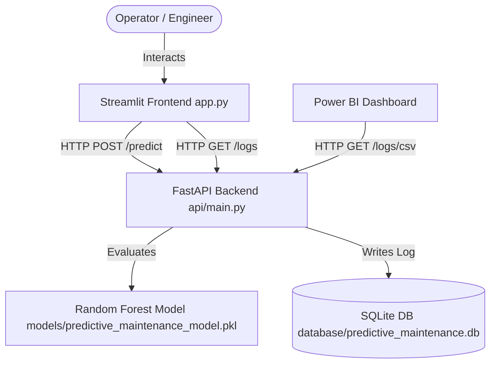

# ⚙️ Predictive Maintenance System

An end-to-end Machine Learning and IoT analytics application designed to predict machinery failure using manufacturing telemetry. The system features a FastAPI backend, SQLite prediction logging, an interactive Streamlit diagnostic control center, and Power BI visualization capabilities.

---

## 🏛️ System Architecture



---

## 📂 Repository Structure

```text
├── api/
│   ├── logger.py             # Custom logging & HTTP request middleware
│   ├── main.py               # FastAPI entrypoint, endpoints (/predict, /logs, /logs/csv)
│   ├── model_loader.py       # ML Model deserializer & checker
│   ├── predictor.py          # Feature engineering pipeline & model inference
│   └── schemas.py            # Pydantic data schemas
├── data/
│   ├── processed/            # Feature engineered training datasets
│   └── raw/                  # Original manufacturing dataset (ai4i2020.csv)
├── database/
│   ├── connection.py         # SQLAlchemy connection & session manager (SQLite)
│   ├── create_table.py       # Helper script to initialize SQLite schemas
│   └── models.py             # SQLAlchemy schemas (prediction_logs table)
├── models/
│   └── predictive_maintenance_model.pkl  # Trained Random Forest classifier
├── notebooks/                # Jupyter Notebooks for EDA & ML training
├── 07_powerbi_dashboard/     # Power BI integration guide & suggested KPIs
├── 08_docker_deployment/     # Docker installation & orchestration guide
├── 09_azure_deployment/      # Azure & Render cloud hosting configurations
├── 10_logging_monitoring/    # Telemetry logging & application performance guide
├── app.py                    # Streamlit diagnostic control center application
├── Dockerfile                # Production container blueprint
├── docker-compose.yml        # Orchestration configuration with database volumes
├── requirements.txt          # Python dependencies
└── .gitignore                # Version control exclusions
```

---

## 🚀 Quick Start Guide

### Prerequisites
* Python 3.10+
* Docker Desktop (optional, for containerized run)

### Local Setup (Manual)

1. **Clone the repository and enter the directory:**
   ```bash
   cd "D:\Preventive maintanence"
   ```

2. **Activate the virtual environment & install dependencies:**
   ```bash
   .\venv\Scripts\activate
   pip install -r requirements.txt
   ```

3. **Initialize the SQLite database schema:**
   ```bash
   python database/create_table.py
   ```

4. **Launch the FastAPI backend server:**
   ```bash
   python -m uvicorn api.main:app --reload --port 8000
   ```
   * The API Swagger documentation is available at: [http://localhost:8000/docs](http://localhost:8000/docs)

5. **Open a new terminal, activate environment, and run the Streamlit frontend:**
   ```bash
   streamlit run app.py
   ```
   * Access the interactive Control Center at: [http://localhost:8501](http://localhost:8501)

---

## 🐳 Containerized Setup (Docker)

To run both the API and database persistence without local Python setup:

1. **Build and start services:**
   ```bash
   docker compose up --build -d
   ```
2. **Access backend API:** [http://localhost:8000/docs](http://localhost:8000/docs)
3. **Database Persistence:** The SQLite database is written to `./database/predictive_maintenance.db` on your local host system, ensuring no data loss when containers restart.
4. **Shutdown services:**
   ```bash
   docker compose down
   ```

---

## ☁️ Cloud Deployment

The system is cloud-ready and can be deployed in two ways:
* **Render (Recommended):** Uses the `render.yaml` blueprint to auto-provision a Docker Web Service with a persistent disk volume.
* **Azure App Service:** Deploys the Docker container to Azure App Service and enables persistent storage configuration settings.
* *Detailed instructions can be found in [09_azure_deployment/README.md](file:///d:/Preventive%20maintanence/09_azure_deployment/README.md).*

---

## 📊 Analytics & Dashboards (Power BI)

Power BI connects directly to your live system using the streaming CSV endpoint:
```text
https://<YOUR_API_URL>/logs/csv
```
Power BI will auto-refresh database logs over HTTPS without needing local ODBC configurations. 
* *Detailed instructions and suggested KPIs can be found in [07_powerbi_dashboard/README.md](file:///d:/Preventive%20maintanence/07_powerbi_dashboard/README.md).*
